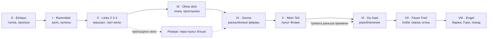
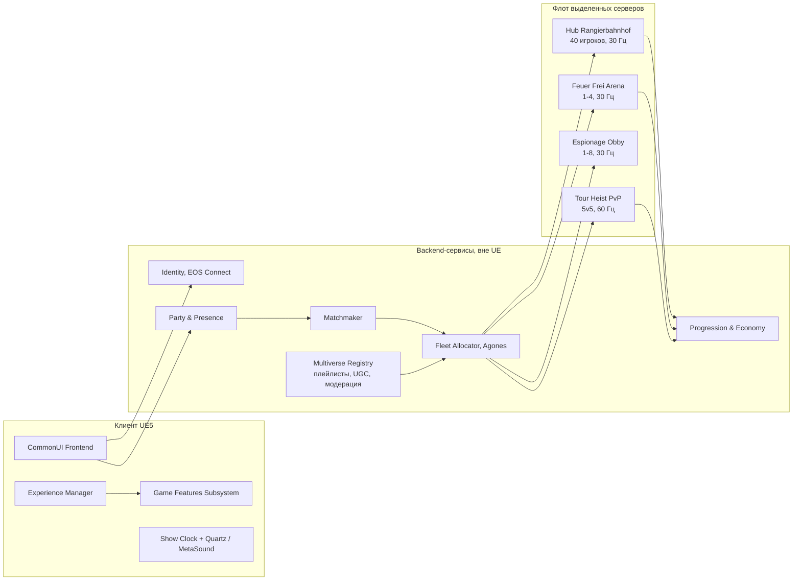
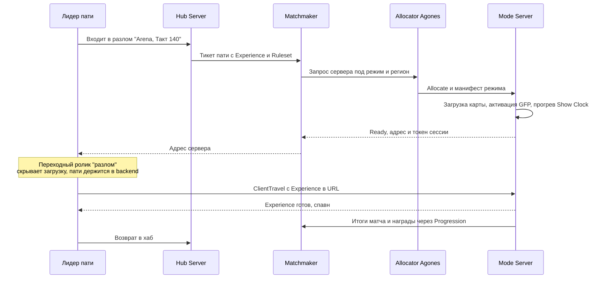
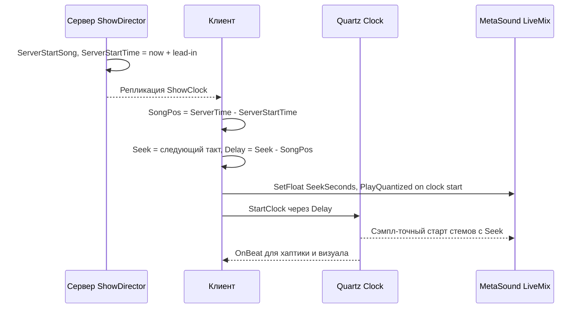
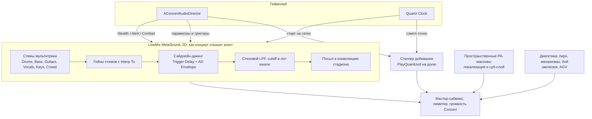

# ROSTFALL

### Game Design Document · креативный и технический концепт · v0.1 (pre-production)

> **Авторы роли:** Lead Game Designer · Creative Director · Senior Technical Architect
> **Статус:** концепт на гринлайт. Всё, что связано с реальной группой Rammstein (имена, образы, записи, товарные знаки), возможно только по лицензии. См. [§13.1](#131-лицензирование-rammstein--критический-путь).
> **Код:** адаптивный аудио-менеджер на MetaSound + Quartz лежит в [`Source/Rostfall/Audio`](Source/Rostfall/Audio). Разбор — в [§12](#12-адаптивный-звук-metasound--quartz).

---

## Содержание

1. [Паспорт проекта](#1-паспорт-проекта)
2. [Название, логлайн, позиционирование](#2-название-логлайн-позиционирование)
3. [Мир: Кессельштадт](#3-мир-кессельштадт)
4. [Арт-дирекшен](#4-арт-дирекшен-фотореальный-машинариум)
5. [Протагонист и персонажи](#5-протагонист-и-персонажи)
6. [Rammstein в лоре: Индустриальные Боги](#6-rammstein-в-лоре-индустриальные-боги)
7. [Core-геймплей](#7-core-геймплей)
8. [Миссия 07 «Ночь Настройки»: стелс на концерте](#8-миссия-07-ночь-настройки-стелс-на-концерте)
9. [Эндгейм: мультивселенная «Параллельные Такты»](#9-эндгейм-мультивселенная-параллельные-такты)
10. [Архитектура мультивселенной в UE5](#10-архитектура-мультивселенной-в-ue5)
11. [Технологический стек и бюджеты](#11-технологический-стек-ue5-и-бюджеты)
12. [Адаптивный звук: MetaSound + Quartz](#12-адаптивный-звук-metasound--quartz)
13. [Продакшн, риски, доступность](#13-продакшн-риски-доступность)

---

## 1. Паспорт проекта

| Параметр | Значение |
|---|---|
| Рабочее название | **ROSTFALL** |
| Жанр | Стелс-экшен-триллер от третьего лица: шпионская песочница, кооп- и PvP-эндгейм |
| Движок | Unreal Engine 5, ветка 5.6+. Экспериментальные фичи проверяем на вертикальном срезе |
| Платформы | PS5 / PS5 Pro, Xbox Series X\|S, PC (DX12, аппаратный RT) |
| Целевая частота | 60 FPS в режиме «Performance», 30/40 FPS в «Fidelity». На PC без лимита, в фоторежиме опционально Path Tracer |
| Рейтинг | PEGI 18 / ESRB M: жёсткие добивания (между роботами, но выглядят жестоко) |
| Кампания | 12 миссий, 14–18 часов, 30+ часов на 100% |
| Эндгейм | Хаб «Rangierbahnhof» и 3 режима: Feuer Frei Arena, Espionage Obby, Tour Heist PvP. Плюс пользовательские полигоны |
| Бизнес-модель | Кампания продаётся как премиум. Эндгейм — бесплатные сезоны, монетизируется только косметика |
| Референсы | *Hitman WoA* (социальный стелс в толпе, «возможности»), *Splinter Cell: Chaos Theory* (свет и звук как системы), *Uncharted 4* (режиссура паркура), *Machinarium* (мир и характер роботов), «Казино Рояль» / «Скайфолл» / «Квант милосердия» (тон, бой, сцена в опере), *Hi-Fi Rush* (бит как системный слой, но без мультяшности) |

---

## 2. Название, логлайн, позиционирование

### 2.1 Название

**ROSTFALL** = нем. *Rost* («ржавчина») + англ. *fall*. Это отсылка к «Скайфоллу» и к падению ржавой империи. Слово одинаково жёстко звучит на немецком, английском и русском. В логотипе из клёпаного листа буква **O** — шестерня, в прорези которой виден прицел.

**Слоган:** *«Каждый удар — в такт.»* (EN: *Every kill on the beat.*)

### 2.2 Логлайн

> Списанный механический спецагент **Виктор Шталь** за одну ночь, между первым и последним аккордом, проникает на огнедышащий концерт **Индустриальных Богов**, колоссальных роботов Rammstein. Его цель — сорвать заговор магната, который хочет перехватить главный ритм города и превратить миллионы роботов в послушный часовой механизм.

### 2.3 Позиционирование

*Для игроков 25–45 лет, которые любят взрослые шпионские триллеры, иммерсивный стелс и тяжёлую музыку.* **ROSTFALL** — это AAA-стелс, где музыка **не сопровождает геймплей, а является им**. Бит маскирует шаги, пиротехника слепит охрану, соло гитары обесточивает камеры. Главная локация — живой стадионный концерт, который идёт в реальном времени и не ждёт игрока.

### 2.4 Уникальные торговые предложения (USP)

1. **Концерт как система.** Бит, свет, жар и пиротехника — это переменные стелса, а не декорации.
2. **Индустриальные Боги.** Культовая группа встроена в лор, её шоу — главная локация и сюжетный механизм.
3. **Фотореальный Машинариум.** Трогательные роботы-силуэты в материалах кинематографического качества.
4. **Бондиана без глянца.** Приземлённый, тяжёлый и «дорогой» по ощущениям экшен в духе эпохи Крейга.
5. **Мультивселенная после финала.** Хаб и режимы переиспользуют ту же Show-систему: контент масштабируется данными, а не кодом.

### 2.5 Опоры дизайна (Design Pillars)

| Опора | Что значит | Как проверяем |
|---|---|---|
| **«Бит — это укрытие»** | Звук концерта — основной ресурс стелса | Если выключить музыку, миссия проходится заметно хуже |
| **«Вес металла»** | Герой весит 380 кг: инерция, вмятины, искры | Каждое действие оставляет физический след (Chaos, декали, звук) |
| **«Шпион, а не супергерой»** | Одна ошибка стоит дорого, импровизация важнее прокачки | Нет регенерации в бою, нет стрельбы сквозь стены, нет «суперчутья» |
| **«Шоу должно продолжаться»** | Концерт никогда не ставится на паузу ради игрока | Сет-лист идёт по своему времени, пропущенные окна закрываются |

---

## 3. Мир: Кессельштадт

### 3.1 Концепт

**Кессельштадт** (*Kesselstadt*, «Город-Котёл») — вертикальный мегаполис роботов. Он вырос внутри остывшего гигантского котла размером с кальдеру. Как в Machinarium, город растёт вверх, и каждый ярус держится на ржавых опорах нижнего. Воздух никогда не бывает прозрачным: пар, копоть, рыжая пыль.

| Ярус | Характер | Геймплейная роль |
|---|---|---|
| **Oben** (Верх) | Латунь, стекло, чистый пар. Резиденции магнатов, башня «Drossel Taktwerke AG» | Социальный стелс, приёмы, допросы |
| **Mitte** (Середина) | Цеха, рынки, трамваи на зубчатой рейке, трубы Рорфунка | Паркур по крышам, погони, контрабанда |
| **Unten** (Низ) | Мазутные болота, свалки, повстанцы «Rostkinder» | Выживание, вылазки, чёрный рынок |
| **Die Große Esse** (Великий Горн) | Стадион в теле мёртвой доменной печи с 240-метровой трубой | Концертная арена миссии 07 и эндгейма |
| **Gleisnetz** (Рельсовая сеть) | Бронированные паровые поезда турне | Погони, Tour Heist PvP |

### 3.2 Как устроено общество

- **Taktwerk** (сердце-маятник). У каждого робота в груди стоит балансир — механическое сердце. Все сердца синхронизированы с **Großer Takt**, мастер-часами города.
- **Rohrfunk** («трубное радио»). По сети пневмотруб такт и новости доходят до каждого дома.
- **Taktverlust** («потеря такта»). За год сердца расходятся. Робот, выпавший из ритма, заикается, путается, а потом ломается.
- **Schmiergeld** («смазочные деньги»). Валюта города — масло. По-немецки это слово буквально значит «взятка». Коррупция здесь — не метафора, а экономика.
- **Nacht der Stimmung** («Ночь Настройки»). Раз в год Индустриальные Боги дают концерт на Великом Горне. Барабаны Кристофа через Рорфунк перенастраивают *Großer Takt*, и вместе с ним сердце каждого робота в городе. Концерт здесь — рок-событие, религиозный ритуал и критическая инфраструктура одновременно.

### 3.3 Заговор

**Конрад Дроссель**, глава *Drossel Taktwerke AG*, делает 70% сердец-маятников города. В сердцах новых серий спрятан бэкдор. На пике Ночи Настройки его устройство **«Taktgeber»**, тайно встроенное в барабанный подиум Кристофа, подмешает в мастер-такт его «ритмическую подпись». После этого каждый робот с сердцем Drossel станет подчиняться его «Метроному».

Виктор Шталь — один из немногих, кого это не коснётся. У него старое аналоговое сердце завода *Kaltwerk*, который давно закрыт. Поэтому послать можно только его.

---

## 4. Арт-дирекшен: «фотореальный Машинариум»

### 4.1 Принципы

1. **Материальная правда.** У каждой клёпки есть функция, у каждого потёка — причина. Износ рассказывает историю предмета (слоистые материалы Substrate, §11).
2. **Мягкие силуэты, жёсткие материалы.** Пропорции роботов — машинариумовские: крупные окуляры, округлые головы, трогательная сутулость. Поверхности — 8K-эмаль со сколами, окалина, масляная плёнка с радужной интерференцией.
3. **Огонь — единственный чистый цвет.** Базовая палитра: ржавая охра, мазутный чёрный, патина окисленной меди, натриевый оранжевый фонарей. Насыщенные цвета дают только огонь, раскалённый металл и концертные лазеры.
4. **Операторская бондианы эпохи Крейга.** В драке — ручная камера, длинные планы без монтажных склеек. Силуэты на фоне света (как бой в шанхайском небоскрёбе в «Скайфолле», только на фоне LED-экранов сцены). В роликах — анаморфотный кадр 2.39:1, в геймплее — 16:9.
5. **Воздух — это материал.** Пар, дым, окалина и искры есть в каждом кадре (Heterogeneous Volumes, Niagara).

### 4.2 Чего мы не делаем

- Никакого чистого sci-fi хрома и неонового киберпанка. Единственное осознанное исключение — полированная гитара Рихарда.
- Никаких мультяшных лиц: эмоции передают диафрагма окуляра, поза, выброс пара и тембр мотора.
- Никакой пародии на Индустриальных Богов: это самые достойные персонажи мира (§6.1).

---

## 5. Протагонист и персонажи

### 5.1 Виктор Шталь, агент K-7 («Отдел Ö»)

> *«Шталь. Виктор Шталь.»*

| | |
|---|---|
| **Модель** | K-серия завода *Kaltwerk*, снята с производства 30 лет назад. 2,1 м, 380 кг |
| **Внешность** | Асимметричный корпус из донорских деталей: левое предплечье от трамвайного вагоновожатого, правый окуляр новый, но в треснувшей оправе. Шрамы-сварные швы — как шрамы Крейга |
| **Костюм** | Бронированный тактический «Anzug»: керамические пластины под потёртой стальной тканью (Chaos Cloth), вмятины от пуль. Для VIP-зон есть «Smoking-Panzer» — бронесмокинг в стиле «Казино Рояль» |
| **Характер** | Немногословен, циничен, смертельно устал. Чёрный юмор. Сам себя чинит паяльником перед зеркалом (оммаж «Скайфоллу»). Пьёт «Öl — geschüttelt, nicht gerührt» |
| **Геймплейная суть** | Тяжёлый, не сверхчеловек. Реальный урон от падения, перегрев сервоприводов, инерция в паркуре |
| **Сюжетная суть** | Старое сердце неуязвимо для «Taktgeber». Он последний «свободный такт» Отдела Ö |

### 5.2 Ключевые персонажи

| Персонаж | Роль | Образ |
|---|---|---|
| **MUTTER** | Куратор, глава Отдела Ö (аналог M) | Старая пневмопочтовая станция с голосом из раструба. Холодная и заботливая |
| **Uhrmacher** («Часовщик») | Оружейник (аналог Q) | Крошечный робот-ювелир с десятком лупо-окуляров |
| **Konrad Drossel** | Главный злодей, промышленный магнат | Безупречный, гладкий, почти без износа — и потому самый жуткий робот в городе |
| **Der Dirigent** («Дирижёр») | Шеф безопасности Дросселя, мини-босс | Тонкий, с дирижёрской палочкой-клинком. Охотится по ритму |
| **Stimmgabeln** («Камертоны») | Элитная охрана | Слышат шум *вне* бита (§7.2) |
| **Ilse Funke** | Главный пиротехник турне | Союзница с двойным дном. Её ключ-карта открывает пиро-пульт |
| **Konsortium Kurbel** | Консорциум Кривошипа, 6 магнатов | Нефтяной барон, железнодорожный король, владелец Рорфунка, шеф полиции, судья, бывший промоутер Богов |

---

## 6. Rammstein в лоре: Индустриальные Боги

### 6.1 Статус в мире

Шестеро Индустриальных Богов (*Die Sechs*) были выкованы в эпоху Первой Плавки, ещё до того, как построили Кессельштадт. Для города они и рок-звёзды, и жрецы времени: только их концерт возвращает городу общий ритм.

**Правила тона (обязательны для сценаристов и художников):**
- Боги **никогда** не злодеи и не комический рельеф.
- В роликах они не произносят реплик. Их язык — шоу: взгляд, огонь, пауза, удар.
- Масштаб: 18–26 м. Рядом с ними агент как человек у подножия буровой вышки.
- Образы выстроены вокруг узнаваемых ритуалов их реального шоу (огнемёты, котёл, беговая дорожка, крылья, лодка над толпой). Это оммаж, а не копия; финальный дизайн согласуется с группой (§13.1).

### 6.2 Шестеро

#### Тилль — «Der Schmied» (Кузнец)
- **Облик.** 26 м. Грудь — мартеновская печь за чугунной решёткой, челюсть ходит как у дробилки. Голос идёт из граммофонных рупоров-резонаторов в горле. Глаза — два смотровых окна печи.
- **На сцене.** Огнемётная маска с соплами, рука-огнемёт «Brennarm», огнемётный лук. В финале — пылающие крылья из листового железа.
- **В лоре.** Кузнец Ритма: «разжигает» мастер-такт перед настройкой.
- **В геймплее.** Главная переменная жара. После каждого залпа термовизоры охраны слепнут на 1,5 с («Hitzeblende»), но вспышка на миг убирает все тени (Lumen), и агент становится виден. Огонь одновременно укрывает и выдаёт.
- **Техника.** Niagara Fluids (огонь), Heterogeneous Volumes (дым). Жар пишется в Runtime Virtual Texture, и материалы металла вокруг начинают светиться.

#### Рихард — «Der Funkenmeister» (Мастер искр)
- **Облик.** 22 м. Самый отполированный из шестерых: хром, осанка, безупречная линия.
- **На сцене.** Гитара — сварочный аппарат («Lichtbogen-Gitarre»): на соло с грифа срываются электрические дуги.
- **В лоре.** Держит «высокое напряжение» ритуала.
- **В геймплее.** Соло дают скачки напряжения в сети стадиона. Камеры и лазерные растяжки мигают и перезагружаются на 2 с («Stromschwankung»). Соло есть в сет-листе, поэтому окна предсказуемы и их можно выучить.
- **Техника.** Niagara (дуги, искры), MegaLights для мигания тысяч приборов.

#### Пауль — «Der Pendler» (Маятник)
- **Облик.** 21 м, жилистый и неугомонный. Гитара — пневмоклепальный молот.
- **На сцене.** Ездит по сцене на рельсовой каретке и раскачивается на маятнике.
- **В лоре.** «Разгоняет» ритм и связывает музыкантов.
- **В геймплее.** Его каретка — движущаяся платформа через освещённую сцену. Агент может проехать под ней в тени через зону, которую иначе не пересечь.
- **Техника.** Сплайн-движение от Show-таймлайна, детерминированное по часам шоу (§10.4).

#### Оливер — «Der Pfeiler» (Опора)
- **Облик.** 25 м, самый спокойный и почти неподвижный. Ноги буквально вмурованы в опоры сцены: он несущая конструкция.
- **На сцене.** Бас как суб-гармонический резонатор, от которого дрожит весь стадион.
- **В лоре.** Держит «фундамент» такта. По традиции один из Богов переплывает людское море на латунной барже. Этой ночью баржа станет частью побега агента (§8, акт IX).
- **В геймплее.** На басовых дропах с ферм сыплется ржавая пыль и падает видимость. Консорциум прячет свой шифрованный канал в несущей частоте его басового тракта: подключившись к его усилителям, агент подслушивает заговорщиков (акт IV).
- **Техника.** Chaos Fields (вибрация незакреплённых частей), Niagara (пыль), MetaSound (суб-слой).

#### Флаке — «Der Läufer» (Ходок)
- **Облик.** 20 м, долговязый, в очках-окулярах. Клавиши — паровая каллиопа с перфокарточным секвенсором.
- **На сцене.** Бесконечно шагает по беговой дорожке из шестерёнок. Это не гэг: дорожка — **динамо-машина**, которая питает шоу-компьютеры сцены. Каждое шоу Кузнец «варит» его в огромном тигле, и он невредимым выбирается наружу.
- **В лоре.** Архивариус. Перфокарты хранят партитуры всех Ночей Настройки.
- **В геймплее.** Пока идёт номер с тиглем, его пульт без присмотра: это окно взлома чертежей «Taktgeber» (акт VI). Если остановить дорожку, сцена потеряет питание, а концерт — нельзя (§8.3).
- **Техника.** Chaos (кинематика шестерён), интерактивный перфокарточный пазл.

#### Кристоф — «Der Taktgeber» (Задающий ритм)
- **Облик.** 24 м. Ударная установка из шести паровых молотов и бочки размером с газгольдер. Сидит выше всех, на вершине центральной 72-метровой башни.
- **На сцене.** Каждый удар физически уходит по Рорфунку в *Großer Takt*.
- **В лоре.** Сердце города. Устройство Дросселя вмонтировано под его подиум.
- **В геймплее.** Его удары — окна маскировки: бочка прячет шаги, малый барабан прячет удары и разбитое стекло, тарелки прячут добивание (§7.2). Сетка его барабанов — сетка Takt-добиваний (§7.5).
- **Техника.** MIDI-карта барабанов (Harmonix) — детерминированный источник окон маскировки на сервере. Quartz — сэмпл-точная синхронизация стингеров на клиенте (§12).

### 6.3 Шоу как живая локация

**Die Große Esse.** Стадион внутри мёртвой доменной печи на 60 000 роботов-фанатов (Mass Entity, §11.3). Сцена шириной 110 м, шесть башен-труб, центральная башня 72 м, B-сцена-остров в середине толпы. Под сценой машинный зал с коленвалами подъёмников. Над сценой — 1 200 приборов на фермах и подвесные стеклянные ложи VIP («Glaslogen»).

**Как шоу вплетено в жизнь города:**

| Когда | Что происходит в Кессельштадте | Что это даёт геймплею |
|---|---|---|
| За неделю | Очереди, перекупщики билетов за Schmiergeld, облавы полиции, реклама в Рорфунке | Миссии 04–06: подготовка, пропуска, компромат |
| В ночь шоу | Цеха останавливаются, трамваи стоят. Огни всего города пульсируют в такт бочке, это видно из любого района | Открытый мир «замирает»: меньше патрулей, но все смотрят на небо |
| Во время песни | Толпа прыгает на припевах, поднимает зажигалки на балладах, скандирует между песнями | Толпа — маскировка, помеха и индикатор тревоги |
| После настройки | Все часы города начинают тикать синхронно. По Кессельштадту прокатывается видимая волна | Сюжетная точка невозврата |

### 6.4 Show Director: как шоу превращается в данные

Концерт — это не катсцена, а **данные**. Каждая песня описана ассетом `UShowTimeline`:

```text
Song: <ID песни>            // темп и такты берутся из tempo-map лицензированного мультитрека
Sections:
  Intro     bars 1–8     Light 30%   Heat +0
  Verse     bars 9–24    Light 50%   Mask  Kick+Snare
  Chorus    bars 25–32   Light 100%  Heat +120°C/bar   Pyro: Fountains   Crowd: Jump
  Solo      bars 33–40   EMP-window (камеры/лазеры)
  Break     bars 41–44   Silence -> опасно!
  ...
Vamps:    Outro (петля 4 такта, максимум ×6)    // эластичность под темп игрока
HardCues: bar 57 "Große Flamme" (12 огнепушек)  // жёсткие моменты-возможности
```

Типы cue: **Pyro** (огнепушки, мортиры, фонтаны, CO₂-джеты), **Light** (DMX-вселенные → MegaLights), **Stage** (лифты, рельсы, мосты), **Band** (Бог идёт на B-сцену, «варка» Флаке), **Crowd** (прыжок, зажигалки, скандирование), **Mask** (окна маскировки).

**Диегетический интерфейс — «Ablaufplan».** Агент ворует у Ильзе бумажный план шоу с таймингами. Это главный инструмент планирования, аналог «возможностей» Hitman, но привязанный ко времени: *«Бар 57 — Большое пламя. 12 пушек. Термовизоры ослепнут»*.

---

## 7. Core-геймплей

### 7.1 Петля

```text
Разведка  ->  Планирование  ->  Проникновение  ->  Удар  ->  Исход
(Ablaufplan,  (окна шоу,       (стелс, соц.       (Takt-    (побег, погоня,
 прослушка)    маршруты)        стелс, паркур)     добивания) разрушения)
```

### 7.2 Takt-Maskierung: бит как укрытие

Каждое действие производит **шум**. Концерт в каждый момент даёт **маскировку**: фон секции плюс кратковременные окна вокруг ударов барабанов.

`Слышимость = Шум действия − Маскировка(t) − Затухание(дистанция, стены)`. Охранник замечает звук, если слышимость выше его порога.

| Действие | Шум |
|---|---|
| Шаг крадучись | 10 |
| Бег по металлу | 35 |
| Приземление / прыжок | 45 |
| Рукопашное добивание | 55 |
| Выстрел с глушителем | 60 |
| Разбитое стекло | 80 |
| Выстрел без глушителя | 95 |

| Состояние шоу | Фон | Окно удара (±80 мс) |
|---|---|---|
| Баллада | 20 | бочка +15 |
| Куплет | 40 | бочка +20, малый +30 |
| Припев | 60 | бочка +25, малый +35, тарелка +45 |
| Залп пиротехники | 90 на 0,6 с | — |
| Брейк / тишина | 5 | — (самый опасный момент песни) |

**Камертоны** (*Stimmgabeln*): их порог **вне бита на 20 ниже**. Шаг «между долями» они слышат, шаг «в долю» — нет. Игрок учится двигаться на 2 и 4, как в марше.

> **Важно для сети и детерминизма.** Сервер не слушает аудио. Окна маскировки берутся из MIDI-карты барабанов, синхронизированной с часами шоу. Аудио на клиенте лишь сэмпл-точно воспроизводит то же самое.

### 7.3 Свет и жар

- **Видимость** считается по освещённости агента (зонды света и данные cue). Прожектор, прошедший мимо, — это угроза, а не декорация.
- **Жар** (0–600 °C) хранится посегментно на фермах и конструкциях и растёт от прожекторов и пиротехники по cue. Руки агента перегреваются выше 400 °C, ботинки держат до 550 °C.
- **CO₂-джеты** (реальный концертный эффект) охлаждают сегмент и дают 4 секунды белого облака-укрытия.

### 7.4 Паркур: брутальный, а не акробатический

- Лазание, вис, перехват, прыжок с разбега, скольжение по тросу, спуск по цепи, пролом гипсокартона и жести.
- Никакого бега по стенам и двойных прыжков. Масса 380 кг: разгон 0,8 с, торможение с искрами, после длинного прыжка — тяжёлое приземление с перекатом.
- Анимация: Motion Matching для локомоции, Motion Warping под цели прыжков, Control Rig для процедурной подстройки рук к балкам любой высоты.

### 7.5 Рукопашный бой и Takt-добивания

**Schrottkampf** — приземлённая драка в духе «Казино Рояль»: захваты, броски о механизмы, удары о паровые клапаны, использование окружения (пресс, шестерня, тигель).

**Takt-Finisher.** Когда игрок начинает добивание, система **подгоняет скорость анимации (±15%)**, чтобы кадр удара совпал с ближайшей долей или восьмой (алгоритм «beat-warp», §12.4). Если это удалось:
- добивание скрыто маскировкой удара (шум 55 при окне +30…+45);
- в микс уходит басовый стингер ровно на долю, и сайдчейн на миг проваливает музыку. В стелсе стингер проходит через тот же «стеновой» фильтр: удар скорее ощущается, чем слышится;
- копится **Resonanz**. Полная шкала даёт **«Kette»** — цепь из 2–3 добиваний на последовательных долях (ритмический аналог Mark & Execute).

Игроку не нужно быть барабанщиком. Моделирование решателя при 125 BPM показывает:
- добивание с ударом через 0,9 с: 71% фаз такта доводятся до доли, остальные 29% до восьмой, мимо сетки — 0%;
- короткое добивание (удар через 0,45 с): 35% до доли, 35% до восьмой, 29% мимо сетки.

Отсюда **правило для аниматоров**: кадр удара ставится не раньше ~2,7 восьмой от начала монтажа (≈0,65 с при 125 BPM). Тогда окно варпа ±15% всегда накрывает хотя бы одну восьмую, и любое нажатие попадает в сетку. Короткие добивания получают «замах», который можно растянуть. Если удар всё же вне достижимого окна, он происходит «мимо бита»: громко и заметно.

### 7.6 Физические головоломки

| Пазл | Суть | Технология |
|---|---|---|
| **Getriebe-Hack** (взлом редуктора) | Замок открывается, когда выходной вал набирает нужные обороты и фазу. Агент переставляет шестерни в физическом редукторе. Решений несколько, и все честно просчитаны | Chaos (кинематика), Blueprint-решатель передаточных чисел |
| **Dampfnetz** (паровая сеть) | Граф труб, клапанов и потребителей. Давление можно перенаправить, чтобы запитать лифт, создать паровую завесу или сорвать фланец на охранника | Граф давления на сервере, Niagara-пар по состоянию узлов |
| **Blaupausen** (чертежи) | Окуляр в режиме «синьки» показывает внутреннее устройство механизмов: где слабое звено, где кабель | Post-process + stencil, отдельный material layer Substrate |
| **Lochkarten** (перфокарты) | Восстановить последовательность перфокарт секвенсора Флаке по фрагментам партитуры | UMG-пазл с диегетическим пультом |

### 7.7 Допросы (Verhör)

Напряжённые, по-бондовски жёсткие сцены с коррумпированными магнатами. Детектор лжи диегетический: **частота тиканья сердца-маятника** допрашиваемого (слышна и передаётся в хаптику DualSense). Давление — через окружение (пресс, тигель, высота) и улики. Грубость без повода закрывает ветки диалога: ломать долго — значит проиграть время концерта.

### 7.8 Гаджеты Часовщика

| Гаджет | Функция |
|---|---|
| Запонки-магниты | Прилипают к металлу: тихий спуск и вис |
| Часы-мультитул | Микро-резак, отмычка редукторов, хронограф с часами шоу |
| «Stimmgabel»-приманка | Камертон-эмиттер, играет шум «в долю» или «вне доли» |
| Масляная граната | Скользкое пятно, падения, воспламеняется от пиротехники |
| Пистолет «Kolben P9» | Интегрированный глушитель, 7 патронов, отдача как у кувалды |
| Смокинг-броня | Социальный стелс в VIP-зонах ценой брони |

### 7.9 Интерфейс

HUD минимальный и диегетический: свечение шестерни в груди агента (перегрев и Resonanz), *Ablaufplan* в руке, хаптический метроном на каждой доле.

Тревога — это нарастающий гул Камертонов. Он **настраивается в тональность текущей песни**, чтобы не бороться с музыкой, а подниматься из неё.

---

## 8. Миссия 07 «Ночь Настройки»: стелс на концерте

### 8.1 Контекст и цели

Середина кампании. Как сцена в опере в «Кванте милосердия», это момент, где герой впервые видит заговор целиком. Консорциум Кривошипа собирается прямо на концерте, в подвесных стеклянных ложах, уверенный, что грохот шоу — лучшая защита от прослушки.

| | |
|---|---|
| **Главные цели** | 1) Опознать членов Консорциума. 2) Выкрасть чертежи «Taktgeber» из секвенсора Флаке. 3) Не дать установке завершиться. 4) Уйти живым |
| **Опциональные** | Не поднять тревогу до акта VII · 6/6 членов опознаны · Takt-добивания без единого промаха · найти 5 перфокарт-партитур прошлых Ночей |
| **Длительность** | 75–95 минут. Эластичный сет-лист подстраивается под темп игрока (§8.3) |
| **Маршруты** | 3 основных пути (Верх: фермы · Середина: сцена · Низ: машинный зал) и 5 «возможностей» по cue-листу |

### 8.2 Сет-лист как структура миссии

> Названия песен — рабочие, использование требует лицензии. Тексты песен в игре не цитируются.

| Акт | Песня (сет) | Геймплей | Музыкальное состояние | Ключевая технология |
|---|---|---|---|---|
| 0 | Einlass (до шоу) | Социальный стелс в толпе, фальшивый пропуск | Ambient: толпа, скандирование | Mass Crowd, соц. стелс |
| I | *Rammlied* | Проникновение за кулисы под залп открытия | Stealth → залп | Niagara, Chaos Fields |
| II | *Links 2 3 4* | Машинный зал: марширующие патрули, устранение целей в такт | Stealth, окна бочки и малого | Quartz, beat-warp |
| III | *Ohne dich* | **Ложа**: прослушка Консорциума через басовый тракт | Stealth, тишина = опасность | MetaSound, диалоговая система |
| IV | *Sonne* | **Паркур по раскалённым фермам**, погоня за казначеем | Alert, жар растёт с припевом | MegaLights, RVT-жар |
| V | *Mein Teil* | Пульт Флаке: взлом чертежей, паровой пазл | Stealth, окно «тигля» | Chaos, Dampfnetz |
| VI | *Du hast* | **Разоблачение**: разбитое стекло, бой на полной громкости | Combat (вход на долю) | Chaos Destruction |
| VII | *Feuer Frei!* | **Взрывной побег** сквозь огненный узор | Combat, пиро-ловушки | Niagara Fluids, Het. Volumes |
| VIII | *Engel* | Эксфильтрация: баржа над толпой → Горн → поезд | Combat → финальный дроп | Mass, Sequencer + геймплей |



### 8.3 Системы, на которых держится миссия

- **Эластичный сет-лист.** У каждой песни есть «вампы»: петли вступления и аутро, паузы, когда Тилль смотрит в толпу, а она скандирует. Если игрок медлит, группа «тянет» петлю (в пределах лимита). Если лимит исчерпан, шоу идёт дальше, окно закрывается, а миссия включает резервную ветку. Концерт никогда не ждёт бесконечно.
- **Hard cues.** Жёсткие моменты («варка» Флаке, большое пламя, соло) — это возможности. Пропустил — ищи другой путь.
- **Чекпойнты = начала секций.** При смерти аудио перематывается на секцию (`SeekSeconds`), часы шоу — тоже.
- **Толпа считает всё шоу.** Пока нет стрельбы, 60 000 фанатов принимают погоню на ферме за часть номера и ревут от восторга. Бондовская ирония как системное правило.

### 8.4 Прохождение

#### Акт 0 — Einlass (до шоу, ~8 мин)
Сумерки. Весь Кессельштадт мерцает в ожидании: огни пульсируют в холостом ритме. Агент в «Smoking-Panzer» проходит с фальшивым VIP-пропуском, добытым в миссии 06, через фан-зону на 60 000 роботов. Мегафоны Рорфунка, торговцы маслом, перекупщики. Толпа скандирует имя Богов.
- **Геймплей.** Социальный стелс: смешаться с группой, обойти рамку-«камертон», выманить роуди, забрать его бейдж. Ильзе Функе в первый раз проходит мимо, и её ключ-карта от пиро-пульта висит на поясе.
- **Кадр для трейлера.** Свет гаснет. 60 000 окуляров разом поворачиваются к сцене. Тишина. Один удар бочки.

#### Акт I — Rammlied: вход (~6 мин)
Открытие шоу. Шесть башен-труб выбрасывают столбы огня, Боги поднимаются на лифтах из-под сцены.
- **Геймплей.** Залп открытия (шум 90) — единственный момент, когда можно выбить решётку технического люка у всех на виду. Окно 0,6 с после каждого залпа. Опоздал — жди следующего или найди вентиляцию.
- **Музыка.** Снаружи — Ambient (глухо, только бочка сквозь бетон). Люк открывается ровно на долю, и на агента обрушивается «стена» (§12.2).

#### Акт II — Links 2 3 4: машинный зал (~10 мин)
Под сценой ворочаются коленвалы лифтов, над головой грохочет сцена. Камертоны Дирижёра патрулируют **строем в ритм марша**.
- **Геймплей.** Устранение целей под биты барабанов. Патрульный шаг — четыре доли. На «2» и «4» охранник поворачивает голову, на «1» и «3» смотрит вперёд. Агент идёт на «1–3», тарелку использует для добивания. Beat-warp «доводит» удар до сетки, а Resonanz копится для цепи «Kette» на трёх Камертонах подряд.
- **Три цели:** техник Дросселя с ключом к подиуму, связной Консорциума, снайпер на кран-балке (опционально).
- **Физика.** Коленвалы — движущиеся укрытия и ловушки. Тело можно спрятать в противовес лифта: он уедет наверх под следующий cue.
- **Кадр.** Агент в полумраке, вспышки сцены пробиваются сквозь решётку пола, полосы света ложатся на его лицо в такт.

#### Акт III — Ohne dich: ложа (~12 мин), сцена «в опере»
Баллада. Стадион затихает, 60 000 зажигалок. **Самый опасный момент ночи**: маскировки почти нет.
- **Геймплей.** Агент подключается к усилительным шкафам Оливера: в несущей частоте баса спрятан шифрованный канал Консорциума. Голоса магнатов накладываются на балладу, пока агент в полной тишине лежит в кабель-канале.
- **Перелом.** Как в «Кванте милосердия», агент выходит в эфир их канала одной фразой: *«Вам стоит найти место потише.»* Шестеро в разных ложах вздрагивают, встают и уходят. У игрока 90 секунд, чтобы сфотографировать окуляром всех шестерых, прежде чем они растворятся в VIP-коридорах. Идут перекрёстные ракурсы: ложи, толпа, Тилль в луче света.
- **Результат.** Узнаём Консорциум, а Дирижёр узнаёт, что в зале чужой. Уровень угрозы до конца миссии: *Alert*.

#### Акт IV — Sonne: раскалённые фермы (~10 мин)
Казначей Консорциума уходит по техническим мостикам над сценой. У него половина кода доступа к подиуму.
- **Геймплей.** Паркур по фермам осветительного подвеса на высоте 40 м. Прожекторы разогревают металл с каждым припевом (+120 °C на такт). На куплетах свет гаснет, фермы остывают, и это окно для броска. CO₂-джеты можно запустить с пульта, чтобы охладить сегмент и спрятаться в облаке.
- **Препятствия.** Лазеры шоу режут путь в такт, прожекторные головы поворачиваются по DMX-cue, Камертоны на соседних фермах.
- **Финал акта.** Казначей прыгает на подвесную люстру-шестерню. Агент прыгает следом, люстра срывается с одного троса (Chaos) и повисает над сценой. Тилль внизу поднимает голову. Короткий допрос на высоте 40 м под припев: частота сердца казначея выдаёт ложь.
- **Кадр.** Силуэт агента на раскалённой ферме, под ним солнце из 400 прожекторов.

#### Акт V — Mein Teil: пульт Флаке (~10 мин)
Кузнец «варит» Флаке в тигле, внимание всего стадиона приковано к огню.
- **Геймплей, часть 1.** 3 минуты, пока пульт без присмотра. Взлом перфокарточного секвенсора: восстановить последовательность и скачать чертёж «Taktgeber» в окуляр.
- **Геймплей, часть 2 — Dampfnetz.** Устройство уже монтируют в подиум Кристофа. Остановить шоу нельзя: если Флаке сойдёт с дорожки-динамо, сцена обесточится, а сбой Ночи Настройки ввергнет весь город в Taktverlust. Решение — перенаправить пар сценических эффектов в охлаждающий контур подиума. Установка «заклинит» от конденсата, а шоу продолжится.
- **Варианты.** Ключ-карта Ильзе (из акта 0) открывает пиро-пульт и короткий путь. Без неё нужен взлом редуктора служебного лифта.

#### Акт VI — Du hast: разоблачение (~8 мин)
Дирижёр вычисляет агента по «ритмической подписи»: его старое сердце тикает не в такт с остальными. Засада в стеклянной галерее над сценой.
- **Геймплей.** Момент «выбитого стекла». Агент проламывает панорамное стекло галереи, и музыка **на ближайшей доле** бьёт на полную громкость (вход в Combat квантуется, §12.2). Жёсткий бой на мостике B-сцены: рукопашная, оружие Камертонов, окружение.
- **Разрушения.** Секция подвеса рушится (предрасчитанный Chaos-кэш для главного обрушения плюс динамические разломы от действий игрока). Толпа, как и было обещано, ревёт от восторга.
- **Мини-босс.** Дирижёр атакует на сильные доли: его комбо — это ритмический паттерн, который можно выучить и контратаковать в синкопу.

#### Акт VII — Feuer Frei!: взрывной побег (~7 мин)
Огнемётный номер. Сцена превращается в поле огня.
- **Геймплей.** Путь к B-сцене лежит через огненный узор: 12 огнепушек стреляют в такт, и игрок читает паттерн как в ритм-игре, но от третьего лица и с преследованием. Мортиры сбивают Камертонов, если их заманить на сектор залпа.
- **Момент.** Тилль видит агента, загнанного в угол. Пауза в полтакта. Кузнец поворачивает огнемёт на преследователей, и стена огня отрезает погоню. Боги не говорят, они выбирают.

#### Акт VIII — Engel: эксфильтрация (~8 мин)
Финал. У Кузнеца раскрываются огненные крылья.
- **Геймплей.** Латунная баржа ритуала выходит в «людское море». Агент прыгает в неё с B-сцены и плывёт над 60 000 роботами, отбиваясь от Камертонов, которые карабкаются по толпе. Затем подъём по ремонтной лестнице 240-метровой трубы Горна в восходящем горячем потоке, спуск по тросу пиро-ракетной линии к депо и прыжок на крышу уходящего бронепоезда турне.
- **Клиффхэнгер.** На соседнем вагоне стоит Дирижёр. Поезд уходит в туннель. Отсюда вырастает режим **Tour Heist**.

### 8.5 Вертикальный срез

Акты II и VI («Links 2 3 4» и «Du hast») становятся вертикальным срезом. Они доказывают все опоры: маскировку битом, beat-warp, переход Stealth → Combat на долю, разрушения, толпу, производительность самой тяжёлой сцены проекта.

---

## 9. Эндгейм: мультивселенная «Параллельные Такты»

### 9.1 Лор-обоснование

Финал кампании расщепляет *Großer Takt*: Кессельштадт существует в нескольких **параллельных темпах**. Каждая «вселенная» — тот же город, но с другим ритмом и другими правилами. Это диегетически оправдывает и хабы, и режимы, и еженедельные модификаторы («Такт 180: всё в 1,5 раза быстрее»).

### 9.2 Хаб «Rangierbahnhof» (сортировочная станция турне)

- Социальное пространство на 40 игроков на шард: депо бронепоездов, гримёрки, «Probebühne» (репетиционная сцена с мини-играми).
- Гардероб (броня, смокинги, отделка корпуса), мастерская Часовщика (косметика гаджетов), доска контрактов.
- **Разломы (Rifts).** Порталы-арки из шестерён ведут в режимы. Каждый разлом подписан темпом своей вселенной.
- **Кастомные хабы.** Личная «Garderobe»: инстанс-гримёрка игрока, куда он приглашает друзей. Декор из наград, витрина трофеев, собственные «стенды» полигонов.

### 9.3 Feuer Frei Arena — выживание на сцене вечного концерта

| | |
|---|---|
| Игроки | 1–4, кооператив |
| Суть | Волны безумных промышленных роботов на сцене Горна во время **бесконечного концерта** |
| Волна = песня | Темп песни задаёт каденцию спавна, припев включает фазу «Feuer Frei» с активными ловушками, соло даёт ЭМИ-окно |
| Пиротехника как ловушки | Огнепушки у рампы, концертные мортиры, лазерные решётки, CO₂-заморозка, «крылья» Тилля, беговая дорожка Флаке как конвейер-мясорубка |
| Взлом пульта | За «Funken» (внутрираундовая валюта) игроки перепрограммируют cue: сдвигают залп на такт, чтобы накрыть толпу врагов |
| Враги | *Presslinge* (гидропрессы-громилы), *Funkenschwärme* (рои искровых дронов), *Kolbenreiter*, босс *Schrott-Titan* |
| Счёт | Множитель за убийства в долю, за цепи ловушек, за «чистые» волны |

### 9.4 Espionage Obby — хардкорный стелс-паркур

| | |
|---|---|
| Игроки | 1–8 (асинхронно: «призраки» лучших забегов) |
| Суть | Полоса препятствий по **движущимся декорациям** гигантской сцены и высоковольтным линиям |
| Ритм-платформинг | Лифты, кольца, маятники и прожекторы двигаются по сетке песни. Весь курс «дышит» в темпе |
| Высокое напряжение | Линии с фазой тока: «живая» фаза визуализирована и замедлена до читаемого цикла. Касание — разряд и сброс |
| Режимы | Time Trial, Silent Run (ни одного обнаружения), Ghost Race, «Такт недели» |
| Творчество | Встроенный редактор «Werkstatt»: курс из кита модулей, публикация по коду, еженедельные подборки (§10.6) |

### 9.5 Tour Heist PvP — перестрелки на крышах бронепоездов

| | |
|---|---|
| Игроки | 5 на 5: **Crew** (грабители) против **Werkschutz** (охрана турне) |
| Карта | Кольцевая рельсовая сеть с 2–3 поездами, идущими параллельно и навстречу: мосты, туннели, стрелки |
| Цель | Похитить «жемчужину турне» (мастер-плёнки, прототип огнемёта Кузнеца, архив перфокарт Флаке) и донести до точки эвакуации (дирижабль-кран) |
| Механики | Туннели (пригнись или слетишь), расцепка вагонов (разрушаемые сцепки), прыжки между поездами, паровые выбросы, крюк-кошка |
| Раунд | 8–10 минут, лучший из трёх |

### 9.6 Прогрессия эндгейма

Общая **Репутация турне** (косметика, титулы, отделка). Никаких сил за деньги. Сезонные «туры» с новым сет-листом, картой-вселенной и модификаторами темпа.

---

## 10. Архитектура мультивселенной в UE5

### 10.1 Общая схема



**Принцип:** каждый режим — это **композиция данных**, а не отдельная игра.
`Режим = Карта(ы) + Experience + Ruleset + ShowProfile + Модификаторы темпа`.

### 10.2 Experience и Game Feature Plugins (паттерн Lyra)

- Каждый режим — отдельный **Game Feature Plugin**: `GFP_FeuerFreiArena`, `GFP_EspionageObby`, `GFP_TourHeist`, `GFP_Hub`. Код и контент изолированы, плагин активируется только там, где нужен. Можно хотфиксить, выпускать сезонами и отключать удалённо.
- **`URostExperienceDefinition`** (`UPrimaryDataAsset`) описывает режим: список GFP для активации, `PawnData`, наборы `GameFeatureAction` (компоненты, способности GAS, Input Mapping Contexts, виджеты), `ShowProfile` (сет-лист, темп), ссылку на `URostModeRuleset`.
- **`URostModeRuleset`** — чистые данные: таблицы волн, каденция ловушек, условия победы, лимиты. Это то, что может менять UGC.
- Сервер получает Experience через опции URL (`?Experience=Arena_Default&Takt=140`). `UGameFeaturesSubsystem` асинхронно загружает и активирует плагины, `UExperienceManagerComponent` на GameState сообщает о готовности, и только тогда спавнятся пешки.

```cpp
// Эскиз: определение режима как данных (паттерн Lyra Experience)
UCLASS(BlueprintType, Const)
class URostExperienceDefinition : public UPrimaryDataAsset
{
    GENERATED_BODY()
public:
    UPROPERTY(EditDefaultsOnly, Category="Gameplay")
    TArray<FString> GameFeaturesToEnable;           // "FeuerFreiArena", "ShowSystem" ...

    UPROPERTY(EditDefaultsOnly, Category="Gameplay")
    TObjectPtr<const URostPawnData> DefaultPawnData; // способности, input, камера

    UPROPERTY(EditDefaultsOnly, Instanced, Category="Actions")
    TArray<TObjectPtr<UGameFeatureAction>> Actions;  // AddComponents / AddAbilities / AddWidgets

    UPROPERTY(EditDefaultsOnly, Category="Show")
    TSoftObjectPtr<URostShowProfile> ShowProfile;    // сет-лист, темп-карты, cue-таймлайны

    UPROPERTY(EditDefaultsOnly, Category="Rules")
    TSoftObjectPtr<URostModeRuleset> DefaultRuleset; // UGC может подменить разрешёнными полями
};
```

### 10.3 Переход «хаб → режим → хаб»



- Загрузку скрывает стилизованный переход «ирис из шестерён» и аудио-эффект «остановки плёнки». Под ним идут асинхронная загрузка пакетов и активация GFP.
- Внутри режима между раундами — **seamless travel** (Arena: смена сцены-вселенной без разрыва соединения).
- Пати живёт в backend, а не на хаб-сервере, и переживает любые переходы.

### 10.4 Синхронизация часов шоу: один концерт на всех

Проблема: концерт — общий мир с тысячами cue, и у всех клиентов пиро-ловушки должны стрелять в одну долю. Слать RPC на каждый залп дорого и неточно.

**Решение: детерминированное расписание плюс синхронные часы.**
1. Сервер авторитетно хранит `FConcertShowClock { SongIndex, ServerStartTime }` и реплицирует его только при смене песни.
2. Все cue (пиро, свет, сцена, маски) — это **детерминированная функция позиции в песне**: `cue = Timeline(SongPos)`. Геймплей сервера (урон ловушек) и визуал клиента (Niagara) читают одно расписание.
3. Точное серверное время: штатного `GetServerWorldTimeSeconds()` недостаточно. Нужна собственная NTP-подобная синхронизация: RPC-пинги, компенсация RTT/2, медиана по 8 замерам, плавная подстройка вместо скачков. Точность ±5–10 мс.
4. Аудио на клиенте стартует **квантованно**: Quartz-часы запускаются в момент, соответствующий такту песни на сервере. MetaSound стартует ровно на старте часов, и локальная синхронизация звука с сеткой сэмпл-точна (код в §12).



Опоздавший игрок входит максимум с задержкой в один такт (1,5–2 с), и она прячется в переходе «разлома».

### 10.5 Репликация по режимам

| Подсистема | Решение | Почему |
|---|---|---|
| Сетевой стек | **Iris** (приоритизация, фильтрация), Replication Graph как запасной путь | Много объектов, дешёвая фильтрация по пространству |
| Хаб | Пространственная фильтрация, 30 Гц, NPC и витрины только косметические | 40 игроков, минимум геймплея |
| Персонаж | `CharacterMovementComponent` с кастомными режимами (Climb, Traverse, Vault, Slide, ZipLine) и сжатыми флагами saved moves. **Mover 2.0** — R&D-спайк | CMC проверен в продакшне, Mover пока экспериментальный |
| Способности | **GAS**: предиктивные монтажи добиваний, Gameplay Cues для VFX | Предикция плюс чистое разделение логики и косметики |
| Beat-warp в сети | Сервер решает warp по **своим** часам шоу (та же математика `ConcertBeatMath::SolveWarp`) и реплицирует PlayRate со способностью. Клиент только проигрывает стингер по Quartz | Скорость монтажа влияет на тайминг урона, значит она авторитетна |
| Поезда (Heist) | Кинематика: `Pos = Spline(Distance(ServerTime))`. Реплицируются только `{SplineId, StartTime, SpeedProfile}`, клиенты вычисляют позицию сами. Физика поездов не участвует | Нулевой трафик, идеальная синхронизация на 120 км/ч |
| Игроки на поездах | Based movement (MovementBase = вагон), позиции относительно вагона. Лаг-компенсация откатывает хитбоксы **в локальном пространстве вагона** | Без этого стрельба на скорости невозможна |
| Разрушения | Геймплейно значимое (укрытия, сцепки) реплицируется как **состояние** (enum на кусок), обломки считаются локально. Большие обрушения — кэшированные Chaos-симуляции | Физика не детерминирована между машинами |
| Толпа (Mass) | Не реплицируется: косметика с сидом от часов шоу | 60 000 агентов по сети невозможны и не нужны |
| Niagara / пиротехника | Косметика по локальным часам шоу. Урон — только на сервере по таймлайну | Нет RPC на каждый залп |

### 10.6 Кастомные режимы и полигоны (UGC)

**Главное правило безопасности: UGC — это только данные, никакого исполняемого кода.**

- Редактор **Werkstatt** (в игре): курс или арена собирается из **каталога разрешённых модулей** (префабы с параметрами) и правил из белого списка полей `URostModeRuleset`.
- Результат — JSON-манифест. Backend валидирует его: схема, лимиты бюджета (число акторов, ловушек, cue), проверка проходимости «призраком»-ботом. Потом модерация и публикация по коду.
- Сервер режима при аллокации получает манифест и спавнит акторы из каталога. Любой неизвестный ID отклоняется.

```json
{
  "schema": "rost.mode.v1",
  "id": "obby-7f3a",
  "experience": "Obby_Default",
  "map": "/GFP_EspionageObby/Maps/Stage_Modular",
  "takt": 150,
  "setlist": ["song_03", "song_07"],
  "ruleset": { "checkpoints": 6, "detectionFails": true, "voltagePhaseSec": 1.2 },
  "props": [
    { "type": "PendulumLight", "t": [1200, 0, 900], "phaseBeats": 2 },
    { "type": "HVLine", "from": [0, 0, 1500], "to": [2400, 0, 1500], "livePhase": "offbeat" }
  ]
}
```

### 10.7 Backend, безопасность, эксплуатация

- **Online Services (OSSv2 / EOS):** кроссплей, друзья, присутствие, голосовой чат (EOS RTC).
- **Прогрессия и экономика** — только в backend, клиент ничего не решает. Сервер режима отправляет подписанные итоги матча.
- **Античит:** Easy Anti-Cheat. Сервер авторитетен в уроне, движении (CMC-валидация) и лут-событиях.
- **Флоты:** Agones на Kubernetes, отдельный флот под каждый режим и регион, автоскейлинг по очередям. Хабы шардируются по 40 игроков, шарды называются по темпу («Takt 120-A»).
- **Телеметрия:** точки смерти, пропущенные окна cue, распределение фаз Takt-добиваний. Так мы балансируем окна маскировки данными.

---

## 11. Технологический стек UE5 и бюджеты

### 11.1 Карта фич

| Задача | Технология UE5 | Применение |
|---|---|---|
| Ржавые детали без лимита полигонов | **Nanite** (+ Nanite Tessellation для заклёпок и чешуи ржавчины крупным планом) | Весь окружающий мир, клёпки и шестерни — реальная геометрия |
| Глобальное освещение, отражения в металле | **Lumen** (HW RT на PC / PS5 Pro, гибрид на консолях) | Огонь реально освещает стадион, металл отражает пиротехнику |
| 1 200 сценических приборов с тенями | **MegaLights** | Прожекторы и стробы как настоящие тенеотбрасывающие источники |
| Слоистый металл | **Substrate**: металл → ржавчина (маска по кривизне и AO) → масляная плёнка с интерференцией (thin film) → копоть → цвета побежалости от жара | Процедурный износ вместо уникальных 8K-текстур везде |
| «8K-металл» | 8K UDIM **только у героев-ассетов** (Боги, агент) через Streaming Virtual Texturing. Остальное — тайлинг плюс Substrate-слои и детальные нормали | Честный компромисс: 8K там, где его видно, без взрыва памяти |
| Огонь, искры, дым | **Niagara** (GPU-симуляции, Data Channels для массовых искр от ударов), **Niagara Fluids** (огнемёты крупным планом), **Heterogeneous Volumes** (дым и пар) | Огнемёты Тилля, дуги Рихарда, пар Dampfnetz |
| Разрушения | **Chaos Destruction**: Geometry Collections, Fields, кэши для режиссированных обрушений | Фермы, стекло лож, сцепки поездов |
| Жар металла | **Runtime Virtual Texture** «heat map», в который пишет Niagara. Custom Primitive Data с температурой на сегмент | Раскалённые фермы светятся и остывают |
| Толпа 60 000 | **Mass Entity + Mass Crowd**, LOD: ~300 скелетных → ~8 000 VAT (AnimToTexture) → импостеры | Толпа прыгает на припевах по часам шоу |
| Световое шоу | **DMX-плагин** и Sequencer; cue-таймлайн в DMX-формате | Художники по свету работают в индустриальных инструментах |
| Анимация | Motion Matching, Motion Warping, Contextual Animation (парные добивания), Control Rig, Chaos Cloth | Тяжёлая локомоция и добивания в любом окружении |
| Город | **PCG Framework**, World Partition, HLOD, Level Instances | Трубы и шестерни вдоль сплайнов, огромные районы |
| Звук | **MetaSound**, **Quartz**, **Harmonix** (MIDI tempo-map, Music Clock), Audio Gameplay Volumes, Convolution Reverb (IR стадиона), Audio Modulation | §12 |

### 11.2 Бюджет кадра: худший случай (сцена концерта, PS5, 60 FPS)

> Цели на вертикальный срез, уточняются профилированием.

| GPU | мс | CPU (game / render / workers) | мс |
|---|---|---|---|
| Nanite + Virtual Shadow Maps | 3,5 | Mass Crowd processors | 2,0 |
| Lumen GI + отражения | 4,0 | AI + Show Director | 2,0 |
| MegaLights | 2,0 | Анимация (параллельно) | 3,0 |
| Толпа (VAT + импостеры) | 1,5 | Chaos физика | 2,0 |
| Niagara + Heterogeneous Volumes | 2,0 | Аудио-рендер (отдельный поток) | < 3 на ядро |
| Пост-обработка + TSR | 2,0 | | |
| **Итого** | **~15,0 / 16,6** | **Game thread** | **≤ 12** |

### 11.3 Толпа как система

- Поведение толпы — функция часов шоу: у каждого агента свой фазовый сдвиг `hash(AgentId)`, поэтому 60 000 роботов прыгают вместе, но не как клоны.
- Секторы толпы несут «возбуждение» (0–1). От него зависят слой толпы в миксе, плотность (можно ли протиснуться) и тревога (стрельба → паника, волна по Mass).
- Пространственный звук толпы — 32 эмиттера по секторам с плотностью и возбуждением из Mass.

---

## 12. Адаптивный звук: MetaSound + Quartz

### 12.1 Слои



- **LiveMix** — перцептивный микс: *как концерт слышит агент прямо сейчас* (за стеной, в трубе, в зале). Это одна MetaSound-графа, поэтому все стемы стартуют и живут сэмпл-синхронно.
- **PA-массивы** дают только направление и суб-слой, чтобы мир звучал с правильной стороны без «двойной» музыки.
- **Стингеры** — ударные басы добиваний. Их ставит в очередь Quartz, они сэмпл-точно ложатся на долю.
- **«Живой трек».** Мультитрек концертной записи сводится под игру и выравнивается по tempo-map (сетка тактов, в том числе с изменениями темпа — через MIDI-темпо-карту Harmonix). Стемы экспортируются от первой сильной доли: сэмпл 0 = такт 1, доля 1.

### 12.2 Музыкальные состояния

| Состояние | Когда | Cutoff | Барабаны | Бас | Гитары | Вокал | Клавиши | Толпа | Реверб | Бленд |
|---|---|---|---|---|---|---|---|---|---|---|
| **Ambient** | Вне стадиона, за бетоном | 350 Гц | 0,8 | 1,0 | 0,2 | 0,1 | 0,2 | 0,9 | 0,8 | 2,0 с |
| **Stealth** | В трубах, кабель-каналах, укрытии | 900 Гц | 1,0 | 0,9 | 0,35 | 0,25 | 0,5 | 0,7 | 0,6 | 1,5 с |
| **Alert** | Охрана насторожилась | 3,5 кГц | 1,0 | 1,0 | 0,8 | 0,6 | 0,7 | 0,8 | 0,4 | 0,6 с |
| **Combat** | Выбито стекло, бой | 20 кГц | 1,0 | 1,0 | 1,0 | 1,0 | 1,0 | 1,0 | 0,25 | 0,08 с |

- **Окклюзия** (0–1) приходит от Audio Gameplay Volumes или трассировок и дополнительно закрывает фильтр **в логарифмической шкале**: ухо слышит октавы, а не герцы.
- **Вход в Combat из Stealth квантуется**: «стена звука» обрушивается на ближайшей доле, а не в случайный момент. Отсюда ощущение «я выбил стекло — и концерт ударил вместе со мной».
- **Стингер добивания** в стелсе проходит через тот же фильтр (LPF на `UAudioComponent`): удар ощущается, а не выдаёт.

### 12.3 Контракт MetaSound-графа `MSS_Concert_LiveMix`

| Вход | Тип | Назначение |
|---|---|---|
| `SeekSeconds` | Float | Start Time всех Wave Player. Нужен для входа посреди песни и чекпойнтов |
| `LowPassCutoffHz` | Float | Стеновой фильтр на шине стемов |
| `DrumsGain` … `CrowdGain` | Float | Линейные гейны стемов. Внутри графа — Interp To ~20 мс против «zipper»-шума |
| `ReverbSend` | Float | Посыл в конволюцию стадиона |
| `FinisherArm` | Trigger | Взвод сайдчейн-дакинга |
| `FinisherDelaySeconds` | Float | Задержка от взвода до доли (Trigger Delay) |
| `FinisherDuckDb` | Float | Глубина дакинга, дБ |

Дакинг живёт **внутри графа**, поэтому он сэмпл-точен относительно музыки. Через границу потоков уходит только сообщение «взвести», и оно опаздывает максимум на один аудиоблок (~10 мс при 512 сэмплах / 48 кГц). При атаке огибающей 10 мс это незаметно. Стингер ставится в очередь Quartz и сэмпл-точен всегда.

### 12.4 Алгоритм beat-warp

Дано: `I` — время от старта монтажа до кадра удара при скорости 1,0; `t₀` — время до ближайшей границы сетки; `G` — длина единицы сетки; `Δ` — калибровка «звук минус картинка» (задержка ТВ и аудиосистемы).

1. Кандидаты: `Tₖ = t₀ + k·G`, где `k = 0…3`. Отбрасываем `Tₖ < 50 мс`: аудиопоток не успеет поставить команду в очередь.
2. Визуальный удар должен случиться в `Tₖ + Δ`, отсюда скорость `rₖ = I / (Tₖ + Δ)`.
3. Берём `k`, где `rₖ ∈ [0,85; 1,25]` и `|rₖ − 1|` минимален.
4. Сначала пробуем сетку долей, затем восьмых. Если не подходит ни одна, удар идёт без квантования (стингер из AnimNotify).
5. Стингер ставится через `PlayQuantized` на `(k+1)`-ю грядущую границу (`CurrentTimeRelative`), дакинг — через `FinisherArm` + `FinisherDelaySeconds`.

### 12.5 Код

| Файл | Что внутри |
|---|---|
| [`ConcertAudioTypes.h`](Source/Rostfall/Audio/ConcertAudioTypes.h) | Состояния, снапшоты микса (с бленд-функцией в лог-шкале), описание песни, `ConcertBeatMath::SolveWarp` — чистая математика beat-warp, общая для клиента и сервера |
| [`ConcertAudioDirector.h`](Source/Rostfall/Audio/ConcertAudioDirector.h) / [`.cpp`](Source/Rostfall/Audio/ConcertAudioDirector.cpp) | Актор-режиссёр: реплицируемые часы шоу, Quartz-часы, запуск LiveMix с выравниванием по такту, бленд состояний, окклюзия, квантованный вход в Combat, Takt-добивания со стингером и дакингом |
| [`ConcertBeatMathTests.cpp`](Source/Rostfall/Tests/ConcertBeatMathTests.cpp) | Automation-тесты решателя beat-warp |
| [`Rostfall.Build.cs`](Source/Rostfall/Rostfall.Build.cs) | Зависимости модуля (AudioMixer, MetasoundEngine, AudioExtensions) |

**Использование в способности GAS (Takt-добивание):**

```cpp
void UGA_TaktFinisher::ActivateAbility(const FGameplayAbilitySpecHandle Handle,
    const FGameplayAbilityActorInfo* ActorInfo, const FGameplayAbilityActivationInfo ActivationInfo,
    const FGameplayEventData* TriggerEventData)
{
    // ImpactTimeInMontage — время кадра удара в монтаже при скорости 1.0 (задаёт аниматор).
    float PlayRate = 1.f;
    if (AConcertAudioDirector* Director = AConcertAudioDirector::Get(this))
    {
        const FConcertFinisherSync Sync = Director->RequestFinisherSync(ImpactTimeInMontage);
        PlayRate = Sync.MontagePlayRate; // 0.85…1.25: удар ляжет на долю вместе со стингером
    }

    UAbilityTask_PlayMontageAndWait* Task = UAbilityTask_PlayMontageAndWait::CreatePlayMontageAndWaitProxy(
        this, NAME_None, FinisherMontage, PlayRate);
    Task->OnCompleted.AddDynamic(this, &UGA_TaktFinisher::OnFinisherCompleted);
    Task->ReadyForActivation();
    // AnimNotify "Impact" в монтаже вызывает Director->NotifyFinisherImpact():
    // это no-op, если стингер уже стоит в очереди Quartz, и запасной путь, если нет.
}
```

**Состояние музыки** задаёт стелс-система агента (локально, у каждого игрока свой микс):

```cpp
Director->SetMusicState(bInCover ? EConcertMusicState::Stealth : EConcertMusicState::Alert);
Director->SetOcclusion(AcousticZone.Occlusion01); // из Audio Gameplay Volume текущей зоны
```

> **Совместимость.** Код написан под API UE 5.4+ (Quartz `UQuartzClockHandle`, `UAudioComponent::PlayQuantized`, параметры MetaSound через `IAudioParameterControllerInterface`). В этом репозитории нет проекта UE, поэтому код не компилировался. Это архитектурный пример, готовый к переносу в модуль игры.

---

## 13. Продакшн, риски, доступность

### 13.1 Лицензирование Rammstein — критический путь

Нужны отдельные соглашения на:
1. имена и образы участников (право на изображение и личность), согласование дизайна роботов с группой;
2. товарные знаки и логотипы;
3. **мастер-записи** концертного мультитрека (права лейбла-правообладателя) и доступ к стемам;
4. **издательские права** на композиции (синхронизация);
5. маркетинг: использование образов и музыки в трейлерах.

**План Б:** вся интеграция data-driven (ростер группы, сет-листы, стемы, cue — это ассеты). Если лицензии нет, группу можно заменить вымышленной без переписывания систем. Это закладывается в архитектуру с первого дня.

### 13.2 Вехи

| Веха | Срок | Критерий выхода |
|---|---|---|
| Концепт и гринлайт | 3 мес. | Этот документ, лицензионный term sheet, прототип маскировки битом |
| Pre-production / вертикальный срез | +9 мес. | Акты II и VI миссии 07 в финальном качестве, 60 FPS на PS5, толпа 60 000 |
| Production | +20 мес. | Кампания feature complete, хаб, Arena, Obby |
| Alpha → Beta | +6 мес. | Контент-лок, сертификация, нагрузочное тестирование флотов |
| Релиз | — | Кампания, хаб, Feuer Frei Arena, Espionage Obby |
| Сезон 1 | +3 мес. после релиза | **Tour Heist PvP** (сетевой риск вынесен из релиза) |

### 13.3 Ключевые риски

| Риск | Влияние | Митигация |
|---|---|---|
| Лицензия на группу | Критическое | Ранний term sheet, план Б (§13.1) |
| Производительность концерта (толпа, свет, пиро) | Высокое | Сцена концерта — вертикальный срез, жёсткие бюджеты (§11.2), LOD-стратегия Mass |
| Экспериментальные фичи (MegaLights, Nanite Tessellation, Mover) | Среднее | Фоллбэки: ограниченное число теневых прожекторов, displacement в текстурах, CMC |
| Сетевой код поездов | Высокое | Кинематика от времени вместо физики, лаг-компенсация в локальном пространстве, режим после релиза |
| Задержка аудио/видео на ТВ ломает ритм | Среднее | Экран калибровки (`AVCalibrationOffsetMs`), щедрые окна, хаптика |
| Музыка утомляет за 80 минут | Среднее | Эластичные секции, Ambient-участки, разнообразный сет-лист, баллады как «вдох» |

### 13.4 Доступность и безопасность

- **Фоточувствительность:** режим ограничения стробов и вспышек (проверка по методике Harding). Пиротехника не выходит за пороги частоты вспышек.
- **Слух:** визуальный метроном (пульсация шестерни в груди) и хаптика долей. Окна маскировки дублируются подсветкой в режиме доступности.
- **Ритм:** расширенные окна Takt-добиваний, опция «авто-такт» без штрафов.
- **Громкость:** громкость «концерта» — отдельный ползунок, нормализация громкости и мастер-лимитер. Концерт в игре не должен звучать громче, чем комфортно.
- **Моторика:** удержание вместо быстрых нажатий, переназначение всего ввода, замедление времени в паркуре.

---

*ROSTFALL — рабочее название. Все упоминания Rammstein и её участников — концептуальные и требуют лицензии правообладателей. Отсылки к фильмам о Джеймсе Бонде и к Machinarium — жанровые и стилистические ориентиры, а не использование их объектов интеллектуальной собственности.*
