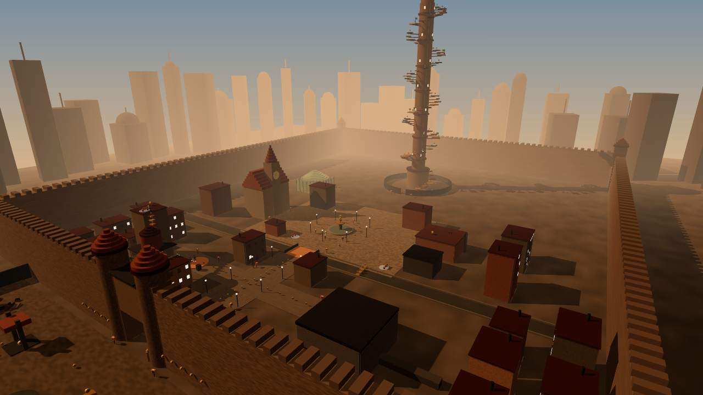
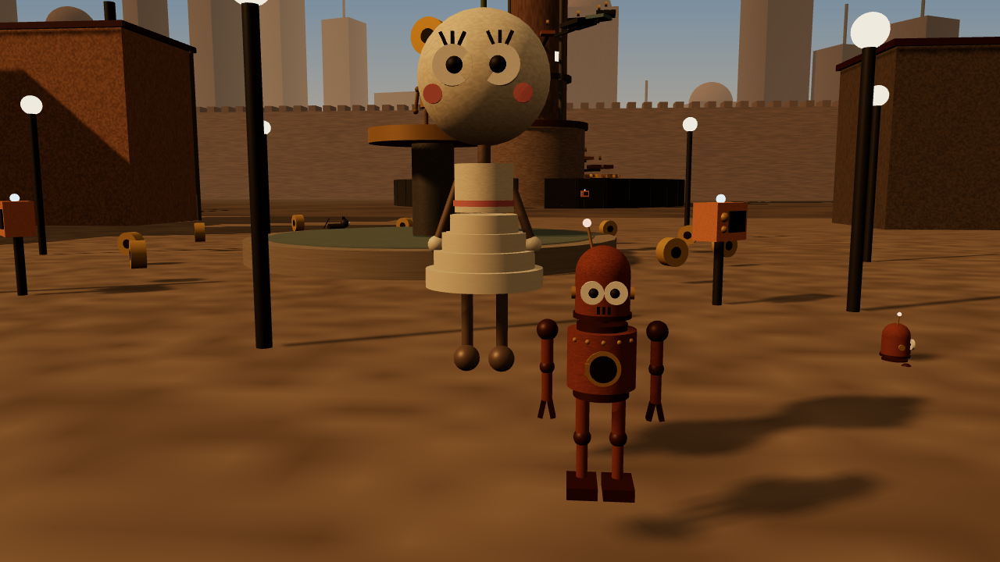
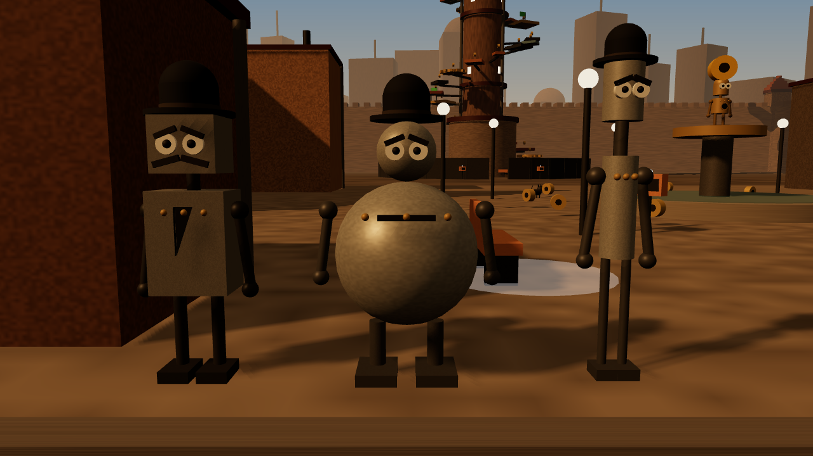
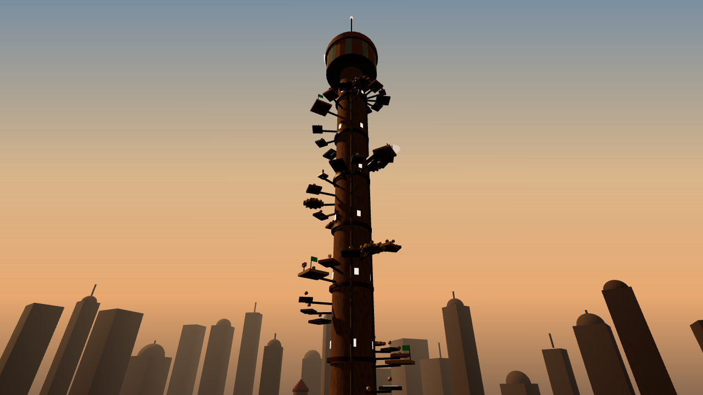
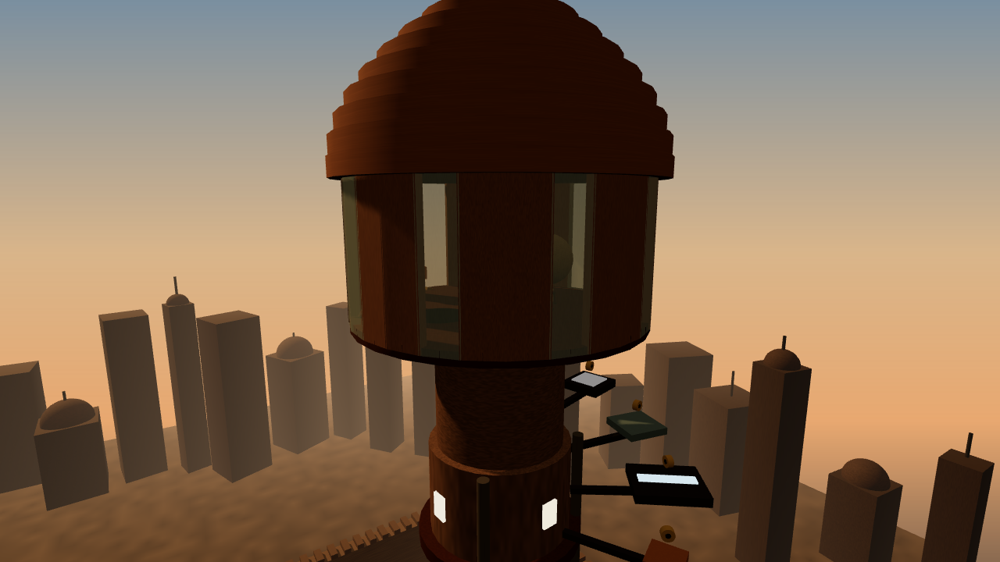
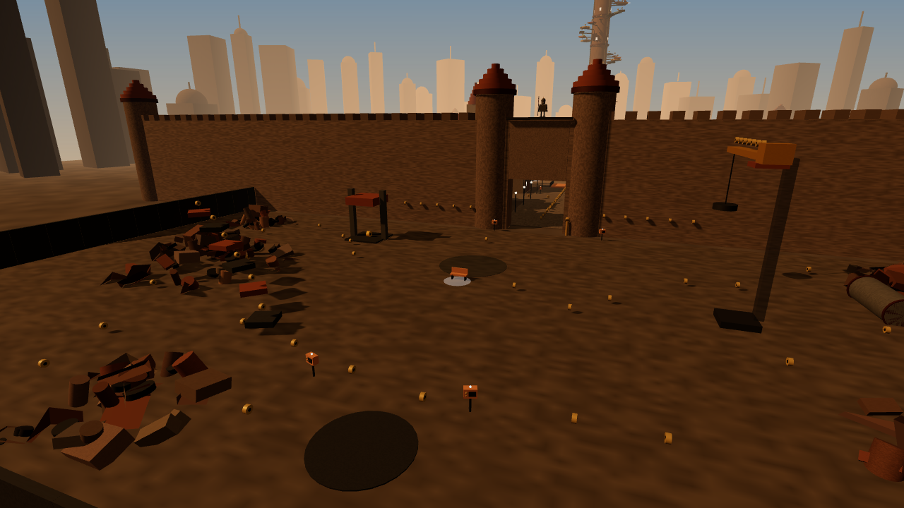
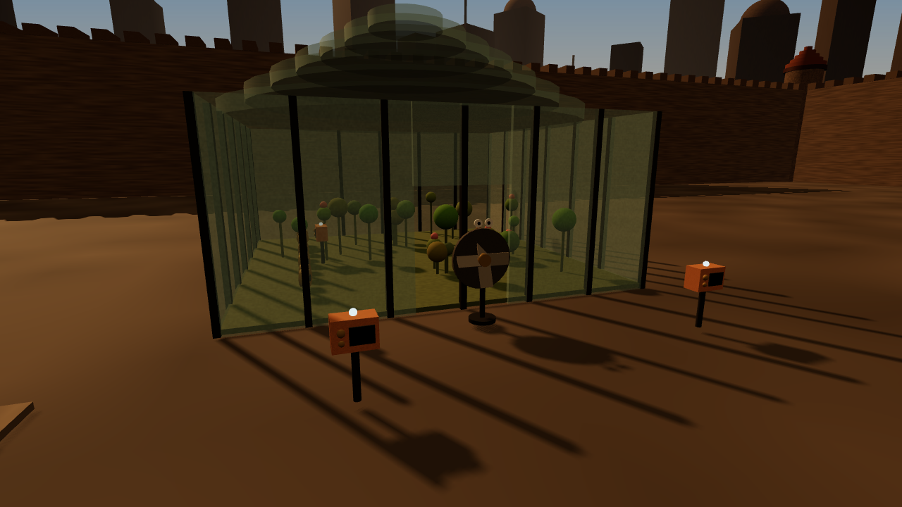
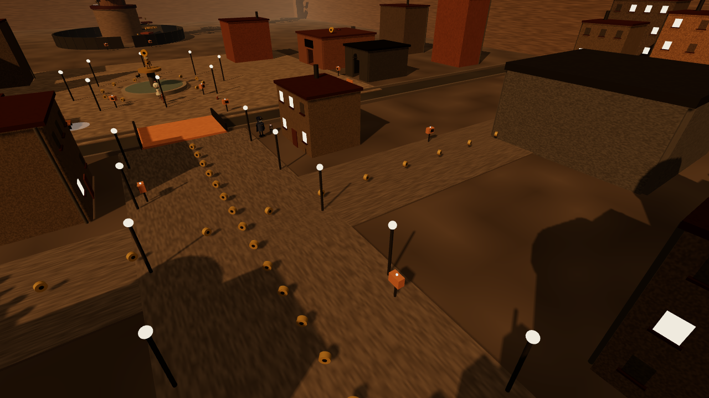

# Machinarium для Roblox 🤖🔩

Фанатская игра для Roblox по мотивам **Machinarium** (Amanita Design, 2009).
Ржавый город роботов, Йозеф, Берта, Братство Чёрной Шляпы, Башня, мини-игры,
паркур, прокачка и пасхалки. Всё построено из деталей Roblox, в стиле Roblox.

> Это неофициальный фан-проект. Machinarium и его персонажи принадлежат Amanita Design.

## Как выглядит

Рендеры настоящей геометрии игры (детали выгружены из постройки мира и отрисованы
three.js — это не скриншоты из Roblox, освещение там будет своё):

| | |
|---|---|
|  |  |
|  |  |
|  |  |
|  |  |

## Как запустить (самый простой способ)

1. Скачай файл **`Machinarium.rbxlx`** из этой папки.
2. Открой его в **Roblox Studio** (двойной клик или *File → Open from File*).
3. Нажми **Play**. Город строится скриптом за секунду-две после старта.

Чтобы прогресс сохранялся, опубликуй место (*File → Publish to Roblox*) и включи
*Game Settings → Security → Enable Studio Access to API Services*.
Без этого игра тоже работает, просто без сохранения.

В игре тип аватара уже выставлен на **R15**: Йозеф собирается поверх R15-персонажа
(для R6 есть упрощённый вариант).

### Через Rojo (для разработчиков)

```bash
rojo serve            # в папке MachinariumRoblox, затем Connect в плагине Rojo
# или
rojo build -o Machinarium.rbxlx
```

Без Rojo `.rbxlx` пересобирается командой `python3 tools/build_rbxlx.py`.

## Управление

| Клавиша | Действие |
|---|---|
| **E** | Вытянуться (Йозеф становится высоким) / вернуть рост |
| **Q** | Сжаться (пролезть в вентиляцию, подкрасться к коту) / вернуть рост |
| **F** | Взаимодействие: поговорить, взять, починить |
| **Пробел в воздухе** | Ракетный ранец (после прокачки) |
| Набрать `rebol` | Секретное меню разработчиков (как в оригинале) |

На телефоне всё то же самое делается кнопками внизу экрана.

## Сюжет (11 глав, как в оригинале, но покороче)

1. **Собери себя.** Братство выбросило Йозефа на свалку по кусочкам: найди ногу (на горе мусора), руку (в трубе) и антенну (на кране).
2. **Городские ворота.** Стражник на стене не видит коротышку. Вытянись и позови его в переговорную трубу.
3. **Нижний город.** Войди в город, и Чёрные Шляпы тут же тебя схватят.
4. **Побег из тюрьмы.** Сожмись и уползи через вентиляцию. Сокамерники подсказывают пузырями мыслей.
5. **Оркестр и кот.** Диджериду уличного музыканта забито. Подкрадись к коту (сжавшись), поймай его и отнеси музыкантам.
6. **Пять в ряд.** Обыграй робота в пабе в гомоку и получи ключ.
7. **Теплица.** Вентилятор задаёт вопросы. Как в оригинале, его надо *разозлить неправильными ответами*. За правильные ответы дают болты.
8. **Спаси Берту.** Она заперта на кухне Братства за пабом.
9. **Башня.** Паркур по спирали вокруг огромной Башни: шестерёнки, движущиеся платформы, конвейеры, паровые трамплины, электрополосы и чекпоинты.
10. **Бомба.** Запомни порядок проводов в пузыре Главаря и перережь их.
11. **Друг с большой головой.** Почини друга. Финал: Братство падает в сток, а Йозеф с Бертой улетают в закат.

После финала игра продолжается: можно собирать всё, что осталось, и докачивать персонажей.

## Прокачка

**Йозеф** (за болты 🔩): Моторчик (скорость), Пружины (прыжок), Телескоп (вытягивание выше),
Магнит (болты притягиваются), Ракетный ранец (прыжки в воздухе, виден на спине),
Антенна-радар (показывает ближайший несобранный секрет). Есть 7 покрасок: ржавый, медный,
хром, мох, золото, а за достижения — «В чёрной шляпе» и «Шапочка Саморосто».

**Берта** (после спасения ходит за тобой): Масляный суп (приносит болты каждые 30 сек),
Корзинка (сама собирает болты рядом), Цветок любви (+10% ко всем болтам, цветок на голове
растёт), Колёсики (не отстаёт) и 5 платьев.

## Что есть в мире

- **Персонажи:** Йозеф (голова-«пуля», огромные глаза, люк-инвентарь в животе), Берта (круглая голова, юбка-колокол, цветок), Главарь / Толстый / Тонкий из Братства Чёрной Шляпы в котелках (патрулируют и отбирают болты), стражник с алебардой и подзорной трубой, оркестр (диджериду, барабан, саксофон), трое заключённых (толстый, тощий, курильщик), бармен, робот-игрок в гомоку, полицейский и робопёс без батарейки, кот, вентилятор с глазами, большеголовый друг.
- **Локации:** свалка с краном и прессом, городская стена с воротами, Нижний город с тюрьмой и сценой, масляный канал с мостом, Церковная площадь с фонтаном и часами, паб, кухня Братства, теплица, Великая Башня с комнатой-головой наверху.
- **30 фактов** об игре (радиоприёмники на столбах) собраны в «Энциклопедию».
- **5 воспоминаний** о Берте (скамейки): купание, пейнтбол, день рождения, вместе на крыше и беда. Если долго стоять без дела, Йозеф тоже вспоминает, как в оригинале.
- **Книга подсказок** закрыта мини-игрой с пауками и ключом, как в оригинале. На кирпичах иногда складывается слово `rebol`.
- **Пасхалки** (12 шт.): `rebol`, гномик из Samorost, мухомор Amanita, табличка Чапека (R.U.R.), пластинка Floex, часы на церкви, семечко из Botanicula, вишенка Chuchel, скрипучая дверца Creaks и другие.
- **Паркур:** крыши Нижнего города к водонапорной башне, мусорные горы и кран на свалке, спираль Башни.

## Структура

```
MachinariumRoblox/
  Machinarium.rbxlx       готовое место для Studio
  default.project.json    проект Rojo
  src/shared/             Config (сюжет, факты, прокачка), Art (модели персонажей)
  src/server/             Main, World (постройка города), Josef, NPC, Data (сохранения)
  src/client/             Client (HUD и окна), UI, Minigames, Effects
  tools/                  сборка .rbxlx и sourcemap.json
  tests/                  эмулятор Roblox API и прогон всей игры
```

## Проверка

Внутри Roblox Studio игру не запускали (в облачной среде Studio нет). Вместо этого:

- `luau-lsp analyze` с определениями Roblox API: ошибок в именах свойств и методов нет.
- `tests/run_test.luau` запускает сервер и клиент в эмуляции Roblox API и проходит весь
  сюжет от свалки до финала. Он также проверяет прокачку, скины, телепорты, сохранение,
  все окна интерфейса, мини-игры, финальную сцену, толчки Братства и ловушки.

```bash
cd tests && python3 bundle.py && luau run_test.luau
```

Физику (шестерёнки на HingeConstraint, платформы на PrismaticConstraint, конвейеры)
и внешний вид эмулятор не проверяет. Если что-то выглядит криво, координаты лежат
в `src/server/World.luau`.

**Музыки нет:** звуки в Roblox нужно загружать как ассеты, а музыка Floex защищена
авторским правом. Можно добавить свой `Sound` в `SoundService`.

## Источники фактов

- [Machinarium: Wikipedia](https://en.wikipedia.org/wiki/Machinarium)
- [Machinarium Wiki (Fandom): Josef, Berta, Black Cap Leader](https://machinarium.fandom.com/wiki/Josef)
- [Machinarium: TV Tropes](https://tvtropes.org/pmwiki/pmwiki.php/VideoGame/Machinarium)
- [Josef в Samorost Wiki](https://samorost.fandom.com/wiki/Josef_(Machinarium))
- [Machinarium trivia (selmiak)](http://selmiak.bplaced.net/games/pc/index.php?lang=eng&game=machinarium&page=trivia)
- [Прохождение (selmiak / GameFAQs)](https://gamefaqs.gamespot.com/pc/972998-machinarium/faqs/59391)
- [Spiders Puzzle, Machinarium Wiki](https://machinarium.fandom.com/wiki/Spiders_Puzzle)
- [Floex: Machinarium soundtrack](https://floex.cz/works/games/music-for-the-game-machinarium.html)
- [Amanita Design: Wikipedia](https://en.wikipedia.org/wiki/Amanita_Design)
