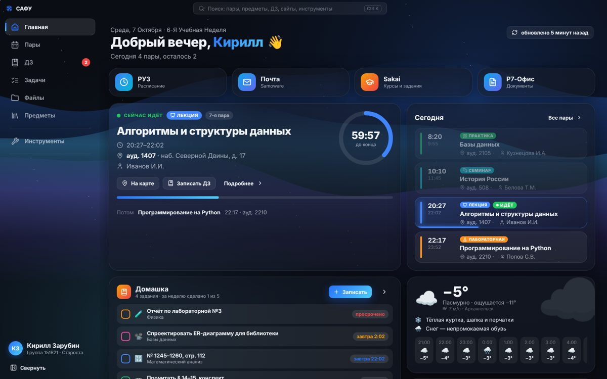
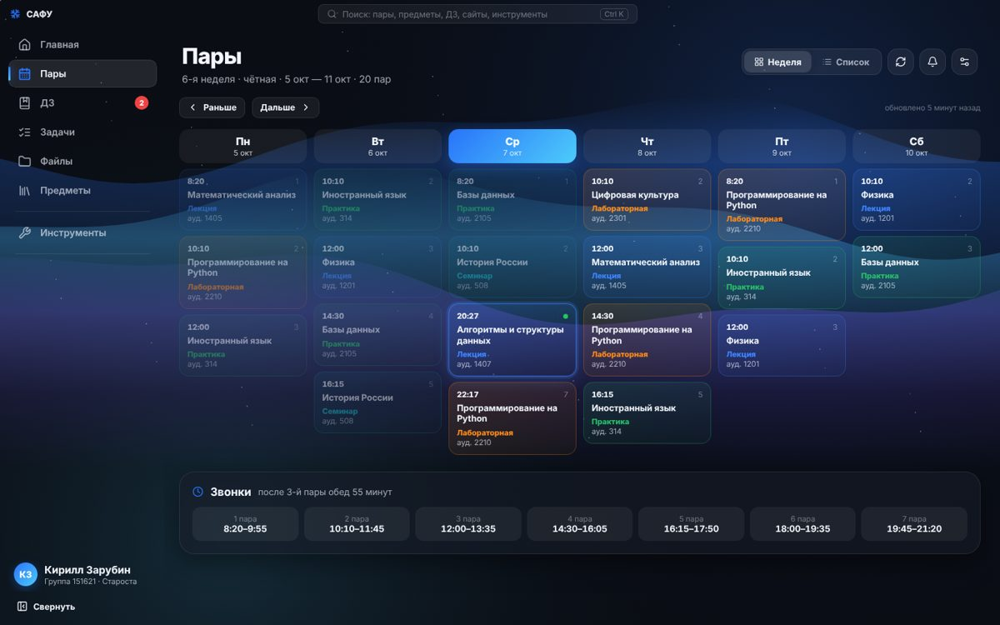
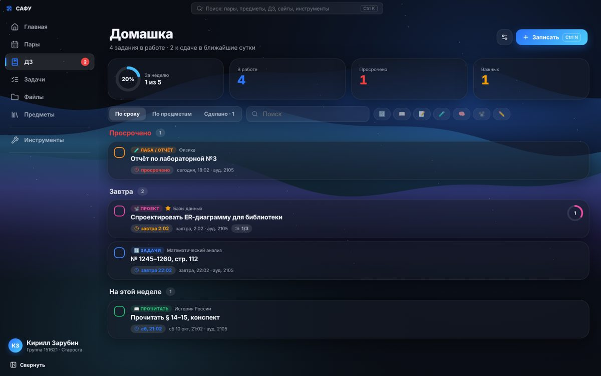
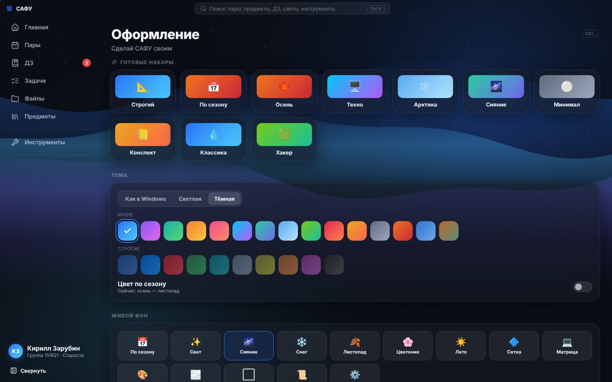
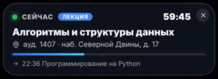

# САФУ для Windows

Всё то же, что в приложении для iPhone, — только на компьютере: пары из РУЗ, домашка с умными сроками, файлы предметов, БРС, сессия, лекции с конспектами, сайты вуза и почта. Интерфейс с живыми фонами, стеклом и анимациями на каждом шаге.



| Пары неделей | Домашка | Оформление |
|---|---|---|
|  |  |  |

Мини-окно текущей пары поверх всех окон (как Live Activity на iPhone):



## Что есть

- **Пары**: расписание группы из РУЗ, неделя колонками и списком, архив прошлых недель, журнал замен и уведомления о них, звонки, ручной ввод, корпуса, экспорт в Outlook/Календарь (.ics), «отправить расписание дня».
- **Главная**: текущая пара с кольцом-таймером, лента дня, ДЗ, погода и «что надеть», дорога на автобусе, отсчёт до сессии, сайты одной кнопкой. Блоки настраиваются перетаскиванием.
- **Домашка**: срок «к следующей паре / такой же паре / через одну» сам переезжает, если РУЗ перенёс пару; прогноз по прошлым неделям; подпункты, фото, напоминания, «Что задали?» после пары.
- **Файлы**: папки предметов в «Документы\САФУ», перетаскивание из Проводника и обратно, миниатюры Windows, поиск, просмотр карточкой.
- **Сайты как мини-приложения Telegram**: Sakai, почта, Р7-Офис, личный кабинет открываются карточкой, сворачиваются в плашку и стопку. Пароли сохраняются и шифруются Windows (DPAPI).
- **Почта**: уведомления о новых письмах (как сайт почты или IMAP), число непрочитанных на значке в панели задач.
- **Инструменты**: БРС с прогнозом, сессия с билетами, преподаватели (полное расписание по вузу), свободные аудитории, карта корпусов, дорога на автобусе 150 и своих маршрутах, подъём к паре, фото доски, лекции (запись → расшифровка на компьютере → конспект через Claude), фокус-таймер, титульник .docx по СТО САФУ, матрицы, статистика, расписание картинкой, посещаемость, рассылка и опросы для старост, праздники с салютами, игра «Автобус 150».
- **Windows**: трей у часов (напоминания работают при закрытом окне), автозапуск, мини-окно пары, Mica, горячие клавиши (Ctrl+K — поиск по всему, Ctrl+N — ДЗ, Ctrl+Alt+S — показать САФУ), ссылки `safu://`, вход по PIN-коду, шторка приватности.
- **Перенос с iPhone**: восстановление из копии `.safubackup` iOS-версии — расписание, ДЗ, задачи, заметки, оценки, настройки и файлы.

## Установка

Готовые файлы — в [Releases](../../releases) (сборки `win-…`, черновики видны владельцу репозитория):
- `SAFU-Setup-*.exe` — установщик;
- `SAFU-Portable-*.exe` — без установки.

Требования: Windows 10 или 11 (64-бит).

## Сборка из исходников

```bash
cd windows
npm install
npm run dev      # запуск в режиме разработки
npm test         # тесты разбора РУЗ, расписания, ДЗ, автобусов, копий
npm run dist     # установщик в windows/release (собирать на Windows)
```

Каждая загрузка в `main` собирается через GitHub Actions (`.github/workflows/windows.yml`), и установщик появляется в Releases.

**Структура:**
- `electron/` — главный процесс: окно, трей, мини-окно, уведомления по расписанию, файлы, почта, пароли, конспекты через Claude API;
- `src/lib/` — логика: РУЗ, расписание, ДЗ, автобусы, погода, БРС, сессия, копии (перенесено из iOS-версии);
- `src/pages/`, `src/ui/`, `src/sites/`, `src/fx/` — интерфейс, сайты-карточки, живые фоны и салюты.

## Конфиденциальность

Все данные хранятся только на компьютере, у приложения нет своего сервера. Подробно — в разделе «Автор → Конфиденциальность» в приложении и в [PRIVACY.md](../PRIVACY.md).
